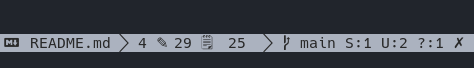

# Git Status - Plugin for [micro editor](https://micro-editor.github.io)

Information about git in status bar.



## Installation

### Settings

Add this repo as a **pluginrepos** option in the **~/.config/micro/settings.json** file (it is necessary to restart the micro after this change):

```json
  "pluginrepos": [
    "https://codeberg.org/micro-plugins/git-status/raw/branch/main/repo.json"
]
```

### Install

In your micro editor press **Ctrl-e** and run command:

```
> plugin install gitStatus
```

or run in your shell

```sh
micro -plugin install gitStatus
```

## Options

The status plugin provides some functions for modifying the status line.

Using the `statusformatl` and `statusformatr` options, the exact contents
of the status line can be modified. Please see the documentation for
those options (`> help options`) for more information.

This plugin provides functions that can be used in the status line format:

| Function         | What it does
| ---------------- | ------------
| `gitStatus.info` | returns information about git status

## Options

You can set the following options:

| Option                     | Purpose                                                       | Default
| -------------------------- | ------------------------------------------------------------- | -------
| `gitStatus.iconBranch`     | branch icon                                                   | ``
| `gitStatus.iconNoGit`      | icon when you don't have git                                  | `?`
| `gitStatus.iconConflict`   | icon when there is conflict                                   | ``
| `gitStatus.iconBehind`     | icon when repository is behind in remote commits              | `↓`
| `gitStatus.iconAhead`      | icon when repository is ahead in remote commits               | `↑`
| `gitStatus.iconStage`      | icon when there are files in staging                          | `S`
| `gitStatus.iconModified`   | icon of when there are changes to the files that git observes | `M`
| `gitStatus.iconUntracked`  | icon when there are files outside git tracking                | `U`
| `gitStatus.iconBranchOK`   | icon when everything is ok in the repo                        | `✓`
| `gitStatus.iconBranchNoOK` | icon when there is status                                     | `✗`
| `gitStatus.commandInterval`| How often in seconds to run a git command                     | 3
